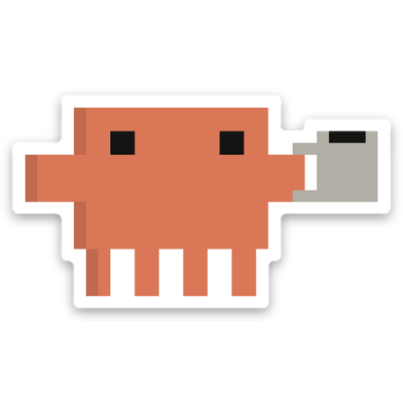

<div align="center">



# cc-notify

**Windows toast notifications for Claude Code — with a custom coffee sticker and random funny phrases.**

Get notified the moment Claude finishes a task or needs your approval, without staring at the terminal.


</div>

---

## What is this?

`cc-notify` hooks into Claude Code's event system to fire a Windows toast notification when Claude:

- **Finishes a task** (`Stop` event) — *"Done cooking ☕ — your code is ready."*
- **Needs your approval** (`PermissionRequest` event) — *"Permission checkpoint 🔐 — approve me maybe?"*

Each notification picks a **random funny phrase** from your phrase set, so it never gets old.
The sticker (custom-made by the author) shows as the app icon on every toast.

Works with both **Claude Code CLI** and the **Claude Code Desktop app** — they both read from `~/.claude/settings.json`.

---

## Prerequisites

| Requirement | Notes |
|---|---|
| Windows 10 or 11 | Toast notifications require Windows 10+ |
| PowerShell 5.1+ | Pre-installed on Windows 10/11 |
| [BurntToast](https://github.com/Windos/BurntToast) | The installer handles this automatically |
| [Claude Code](https://docs.anthropic.com/en/docs/claude-code) | CLI (`npm i -g @anthropic-ai/claude-code`) or Desktop app |

---

## Quick install

Open PowerShell and run:

```powershell
irm https://raw.githubusercontent.com/Ali7020/cc-notify/main/install.ps1 | iex
```

> **Security note:** `irm | iex` downloads and runs a script directly. You can read `install.ps1` on GitHub before running it. The script only copies files into `~/.claude/hooks/` and merges two hook entries into `~/.claude/settings.json` — it never touches anything else.

---

## Interactive setup wizard

If you prefer a guided experience with live previews:

```powershell
git clone https://github.com/Ali7020/cc-notify.git
cd cc-notify
.\setup-wizard.ps1
```

The wizard walks you through each step, lets you preview sample phrases before committing, and shows a dry-run of the settings change before writing anything.

---

## Manual install

If you prefer to do it yourself:

### 1. Copy files

```powershell
$hookDir = "$env:USERPROFILE\.claude\hooks"
New-Item -ItemType Directory -Path "$hookDir\assets" -Force | Out-Null

Copy-Item .\notify.ps1                      $hookDir\
Copy-Item .\phrases.json                    $hookDir\
Copy-Item .\assets\claude_coffe_icon.png    $hookDir\assets\
```

### 2. Install BurntToast

```powershell
Install-Module BurntToast -Force
```

### 3. Wire the hooks

Open `~/.claude/settings.json` in any text editor and merge the following into the `hooks` object.
Make sure you **preserve all existing hooks** (e.g. `PreToolUse`):

```json
"hooks": {
  "Stop": [
    {
      "matcher": "",
      "hooks": [
        {
          "type": "command",
          "command": "& \"$env:USERPROFILE\\.claude\\hooks\\notify.ps1\" -Event \"stop\" -Title \"Claude Code\"",
          "shell": "powershell"
        }
      ]
    }
  ],
  "PermissionRequest": [
    {
      "matcher": "",
      "hooks": [
        {
          "type": "command",
          "command": "& \"$env:USERPROFILE\\.claude\\hooks\\notify.ps1\" -Event \"permission\" -Title \"Claude Code\"",
          "shell": "powershell"
        }
      ]
    }
  ]
}
```

### 4. Restart Claude Code

Hooks are loaded at startup. Close and reopen Claude Code (CLI or Desktop).

### 5. Verify

```powershell
claude /hooks
```

You should see both `Stop` and `PermissionRequest` hooks listed.

---

## Customizing phrases

Edit `~/.claude/hooks/phrases.json` — it's a plain JSON file with two arrays:

```json
{
  "stop": [
    "Done cooking ☕ — your code is ready.",
    "Your custom phrase here.",
    "..."
  ],
  "permission": [
    "Permission checkpoint 🔐 — approve me maybe?",
    "Your custom permission phrase.",
    "..."
  ]
}
```

- `stop` phrases fire when Claude finishes a task.
- `permission` phrases fire when Claude needs your approval.
- Each notification picks a **random phrase** from the relevant array.
- Changes take effect immediately — no restart needed.

---

## Using your own icon

The sticker is a custom PNG made by the author. To use your own:

1. Create a **520 × 520 px PNG** image (square, transparent background works best).
2. Replace `~/.claude/hooks/assets/claude_coffe_icon.png` with your file:
   ```powershell
   Copy-Item your-icon.png "$env:USERPROFILE\.claude\hooks\assets\claude_coffe_icon.png" -Force
   ```
3. No restart needed — the icon is loaded on each notification.

> **Why 520 × 520?** BurntToast displays the `AppLogo` at 48 × 48 logical pixels on screen, but Windows scales for high-DPI displays. 520 px provides sharp rendering at up to 10.8× DPI scaling with no upscaling artifacts.

---

## Hooks reference

| Event | When it fires | Phrase set used |
|---|---|---|
| `Stop` | Claude Code session ends (task complete or manually stopped) | `stop` |
| `PermissionRequest` | Claude needs your approval before executing a tool | `permission` |

**CLI vs Desktop:** Both Claude Code CLI and the Claude Code Desktop app read hooks from `~/.claude/settings.json`. No separate configuration is needed.

---

## Troubleshooting

### Notification doesn't appear

1. **Check Windows notification settings:**
   Settings → System → Notifications → make sure notifications are on.

2. **Check BurntToast is installed:**
   ```powershell
   Get-Module BurntToast -ListAvailable
   ```
   If nothing returns: `Install-Module BurntToast -Force`

3. **Test the script directly:**
   ```powershell
   & "$env:USERPROFILE\.claude\hooks\notify.ps1" -Event stop -Title "Test"
   ```

4. **Check the install log:**
   ```powershell
   Get-Content "$env:USERPROFILE\.claude\logs\cc-notify-install.log"
   ```

### Hooks don't trigger

1. Restart Claude Code completely (close and reopen).
2. Run `claude /hooks` — both Stop and PermissionRequest should be listed.
3. Check that `~/.claude/hooks/notify.ps1` exists.

### Notification appears but no icon

The icon path is resolved relative to `notify.ps1`. Verify the file exists:
```powershell
Test-Path "$env:USERPROFILE\.claude\hooks\assets\claude_coffe_icon.png"
```

### Re-running the installer

The installer is idempotent — running it again will detect existing hooks and skip adding duplicates.

---

## License

MIT — do whatever you want with it. If you build something cool on top, a star ⭐ is always appreciated.
